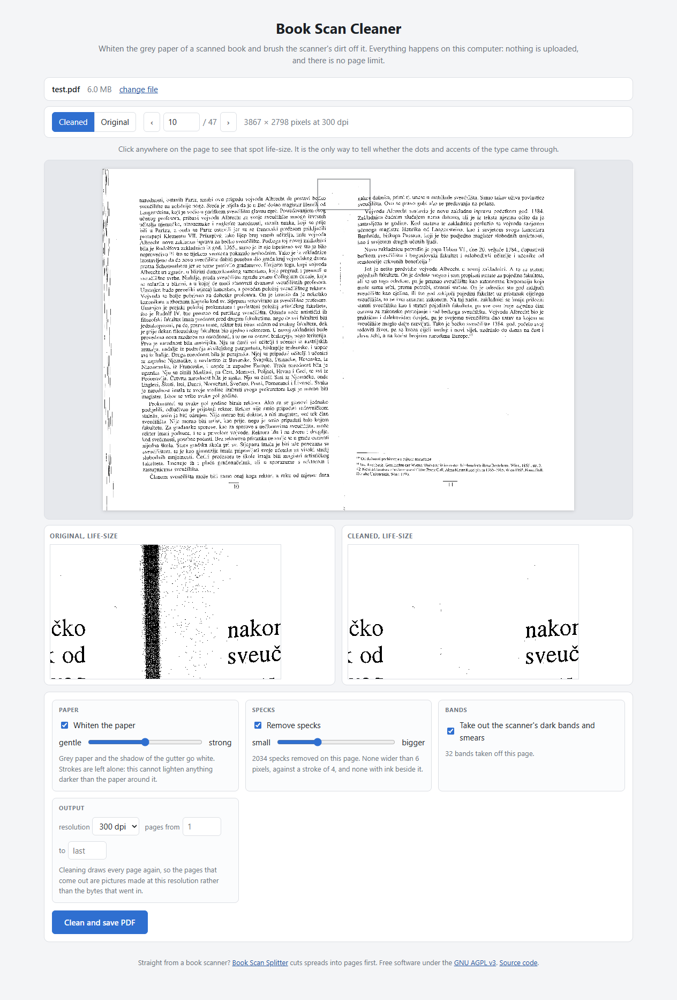
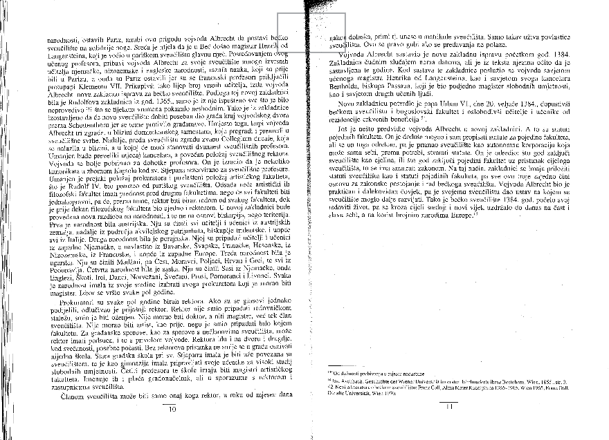
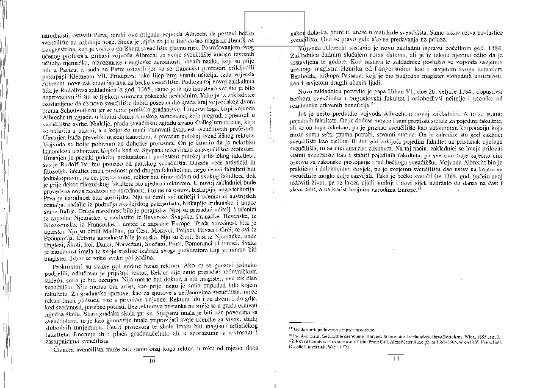
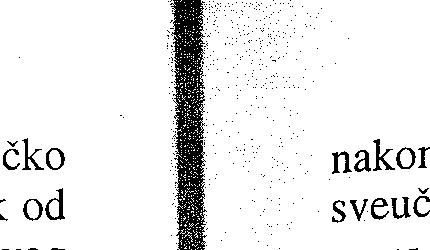
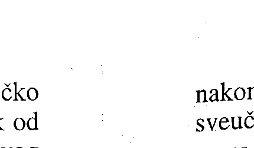

# Book Scan Cleaner

Takes the grey out of a scanned book: paper that comes out white instead of dirty
beige, the shadow along the gutter gone, and the scanner's dust brushed off it.
In your browser, with nothing uploaded and no page limit.

A book scan is lit unevenly by the nature of the thing. The paper reads as grey, one
side of every page is darker than the other where it curves into the gutter, and the
glass and the sheet feeder leave specks all over the margins. That costs you nothing
in ink, but it costs a great deal in file size, in what the page looks like on a
tablet, and in what OCR makes of it.

- **Whiten the paper.** The page is divided by an estimate of the paper itself, tile
  by tile, so grey paper and a gutter's shadow go white while the type stays exactly
  as dark as it was.
- **Take out the specks**, wherever they sit, but only when they are smaller than the
  type on that same page and have clear paper all around them.
- **Take off the dark bands and smears**: the strip down the side where the scanner
  lid did not reach, the shadow the gutter throws down the middle of a two-page sheet,
  and the smear where that shadow burns out.
- **Straighten pages that were scanned crooked**, each one measured on its own.
- **Look at any spot life-size** before you save, side by side with the original.

**→ [Open Book Scan Cleaner](https://it-stoic.github.io/book-scan-cleaner/)**



Scans straight off a book scanner, two pages to a sheet, want
[Book Scan Splitter](https://github.com/it-stoic/book-scan-splitter) first. Cut them
apart there, clean them here.

## Use it

1. Open the link above.
2. Drop your PDF on the page.
3. Click anywhere on the page to see that spot life-size, original next to cleaned.
4. Push the two sliders until it looks right, then press **Clean and save PDF**.

## Before and after

A spread the way the scanner handed it over. Hairlines run down the left edge where the
lid did not reach, and at the top of the gutter the binding's shadow burns out into a
black smear with a cloud of stipple trailing off it. The thin box marks the spot shown
life-size further down.



The same sheet after one pass. The paper is white, the hairlines are gone, and the smear
has been lifted out of the gutter without touching the two columns of type on either
side of it.



Page-sized pictures are not evidence, though, because the thing that goes wrong when a
tool like this goes wrong is a pixel or two across. So look at the same spot life-size,
which is what the app puts in front of you before you save anything:

<p>
  
  
</p>

The smear is gone. The caron is still on the č of *čko* and on the č of *sveuč*, which is
the only part of this that really matters: a tool that whitens a page and eats the
accents off Croatian, Czech or Polish type has made the scan worse, not better.

## What it will not do

**It will not eat your accents.** This is the failure that matters, and the reason
the rule is as narrow as it is: the dot on an i, the caron on a č or a ž, a comma and
a full stop are all small isolated blobs of ink, and so is dirt. Two things have to
be true at once before a blob is dropped. It has to be small measured against the
stroke width of the type on that page, not against some fixed number of pixels, so
the same setting means the same thing at 200 and at 600 dpi. And it has to be alone,
with clear paper all around it and no ink it could be the punctuation of.

Being alone is the whole of the protection, and it is nearly enough, because that is
exactly what a diacritic never is. The dot has its stem a stroke or two underneath it.
The full stop has the word it ends. Dirt in the white of a margin, or in the gap
between two lines, has nothing.

What being alone misses is that dirt is not always alone. In the scatter thrown off a
smear, the neighbours of a fleck of dirt are other flecks of dirt, hundreds of them,
and they used to vote each other innocent. So the company a mark keeps is counted, not
just noticed. Type beside it keeps it, which is what saves a dot on an i. Failing that,
a companion or two and nothing else keeps it, which is what saves the second dot of an
ellipsis, a colon, a pair of quotes: marks that have only each other and are plainly
still marks. A hundred companions are not company, they are a cloud, and a cloud goes.

Whatever fails either test is kept. The tool would rather leave a speck than take a
diacritic.

The other thing being alone misses is dirt that is not dark. Half of what a scanner
leaves is grey rather than black, most of the way to white, and a rule written about
ink never even looks at it: the page's own ink threshold is drawn well below it, so
those flecks were not blobs at all and survived every pass untouched. They are picked
up on a second walk taken at a level near the paper, where the question is whether
there is any real printing inside the blob. A mark of the book's own always has some:
type, and the punctuation set in the same ink, is dark in the middle however soft the
edges came out. A fleck that is pale the whole way through was left by the scanner,
and if it is small and alone as well, it goes. Both walks take the grey halo along
with what they remove, since a speck lifted out of its own halo just leaves a ring.

**It will not take a photograph for a band.** A band is long, thin, and starts at the
edge of the sheet, which is where the scanner is rather than where the book is. A
plate on the page fails the thinness test, a headline fails all three, and a letter is
not remotely large enough to be asked. Only the pixels of the band itself go, with a
stroke of margin for the grey it frays into, so type standing next to one is untouched
unless it is joined to it.

Not everything the scanner leaves is shaped like a band. Where the gutter's shadow
burns out it leaves a smear: a dark mass about as wide as it is long, with stipple
frayed round it, too square to be a band and too crowded to be dirt. That one is found
by weighing the ink instead of reading the shape. Over a patch a few strokes wide, type
covers about a sixth of the paper, because a letter is mostly the white inside it and
around it, and a smear covers half of it and better. What is found that way is asked
the same two questions a band is asked, has it a foot in the margin and is it thin, and
one more: a smear fades at its fringe, and ink that stays solid to the last of it was
put there by a press.

Where a smear runs right up against a column of type, the two are read as one region,
that region comes back too fat to be a smear, and it is refused whole. So the failure
this can have is a smear left on the page. It is not a column of type taken off it.

What it leaves behind, on the scans it has been tried on, is the odd hairline right at
the paper edge, broken into pieces too short to be called a band, and whatever sits
close enough to the type to be spared with it. Trim those off with the splitter if they
bother you.

**It will not turn the page black and white.** No binarisation, on purpose. It is the
one step that makes files really small, and it is also the one that quietly drops
thin strokes and light accents wherever a page runs a little dark. What you get back
is grey, with the paper white.

**It will not preserve your original image data.** This is the honest cost of the
whole thing: cleaning has to decode the picture, change pixels and encode it again.
The pages that come out are drawn afresh at the resolution you pick, rather than the
bytes that went in. If all you need is cutting or straightening, do that with the
splitter, which never re-renders anything, and clean afterwards.

## Is my book uploaded anywhere?

No, and there is nowhere for it to go. The page has no server behind it, makes no
network requests once it has loaded, and does the whole job in your browser. Turn off
your network before dropping the file and it will work exactly the same.

## Keep it as an app

In Chrome or Edge the page offers an **Install as an app** button. Press it and Book
Scan Cleaner gets a desktop icon and a Start-menu entry, opens in its own window, and
works with no internet connection at all: the whole app is stored on your machine on
first use. No administrator rights are needed, so it also works on locked-down office
machines.

Firefox does not show that button and never will, because offering an install is
something only the browser may do there, never the page. On Windows, since Firefox
142, the address bar carries an **Add tab to taskbar** button that pins the page as a
web app. The offline part already works in Firefox either way, because the page
caches itself the same way there.

## Settings

**Whiten the paper**, gentle to strong, moves only the light end of the range: how
close to the paper around it a pixel has to be before it is called white. No setting
of it can lighten a pixel that is much darker than its surroundings, which is why
even the strong end cannot rub out type.

**Remove specks**, small to bigger, sets how large a speck may be before it is left
alone, in multiples of the stroke width measured on that page. Push it and the count
under the slider tells you how many specks went on the page you are looking at.

**Take out the scanner's dark bands and smears** removes the strip down the side, the
gutter's shadow, and the smear where that shadow burns out. It runs before the specks,
which matters: dirt lying along a band has the band for company, and once the band is
gone that dirt stands alone and can be judged on its own.

**Straighten crooked pages (deskew)** measures how far the page is tilted and turns it
back. The measurement is the classic projection profile: the page's ink is rotated
through candidate angles and the sharpest horizontal profile wins, because straight
text lines pile up into tall spikes while crooked ones smear across many rows. A page
with nothing to measure, a full-page photo or a blank, is left alone rather than
guessed at, and the count under the button says how many pages were turned.

It runs *last*, on the page the other three rules have already been over, and the
order is not arbitrary. The bands are the scanner's own furniture, square to the
glass rather than to the book, and the rule that finds them asks for something long,
thin, and with a foot in the margin; turn the page first and past about 4° a band no
longer measures thin enough to be one. The same page's shadow and edge strip are also
the darkest things on the sheet, so measuring an angle before they are gone means
measuring them as if they were text. And straightening is the one step here that
moves a pixel: doing it last leaves the speck rule measuring ink the scanner made
rather than ink an interpolation has smeared.

**Resolution** is the size the pages are drawn at, 300 dpi by default. 200 makes
smaller files out of scans that were never sharp to begin with; 400 is worth it for
small print you intend to run through OCR.

## Run it yourself

The app is plain HTML, CSS and JavaScript, with no build step. It does have to be
served over http rather than opened as a file, because pdf.js cannot load its worker
from a `file://` page. Two libraries live in `vendor/`,
[pdf.js](https://mozilla.github.io/pdf.js/) to read pages and
[pdf-lib](https://pdf-lib.js.org/) to write them.

```sh
pnpm install
pnpm start    # http://localhost:8080
pnpm vendor   # refresh vendor/ from node_modules
pnpm test     # the cleaning rules, on a page built for the purpose
```

`clean-core.js` holds the whole of the image work and `deskew-core.js` the
straightening; neither knows anything about the DOM, both take grayscale bytes and
give grayscale bytes back, which is why the tests can run in Node with no canvas.
`app.js` is the part that turns PDF pages into pixels and back again.

The tests are the interesting half of the repository. Each rule is put on a page built
to break it: type with a mark over every fourth stroke, a page number below the block,
punctuation with nothing beside it, a burn frayed into stipple, a solid plate narrow
enough to look like a band, and a smear pushed up against a column of type. What they
assert is mostly what must *survive*, not what must go.

**Deployment** is GitHub Pages, driven by
[.github/workflows/pages.yml](.github/workflows/pages.yml): every push to `main`
uploads the repository as it stands and deploys it. The workflow declares `pages: write`
and `id-token: write` explicitly, so it does not depend on the repository default for
`GITHUB_TOKEN`.

**After changing any app file, bump `CACHE` in `sw.js`** (`book-scan-cleaner-v4` →
`book-scan-cleaner-v5`). Installed copies serve the cached version until the cache name
changes, so skipping this means users keep running the old build.

## Licence

Free software under the [GNU AGPL v3](LICENSE) or later. If you host a modified
version, its users must be offered its source.

This covers the code in this repository. It does not cover the libraries in `vendor/`,
which keep their own licences.

## Credits

- [pdf.js](https://github.com/mozilla/pdf.js) — Apache-2.0
- [pdf-lib](https://github.com/Hopding/pdf-lib) — MIT
